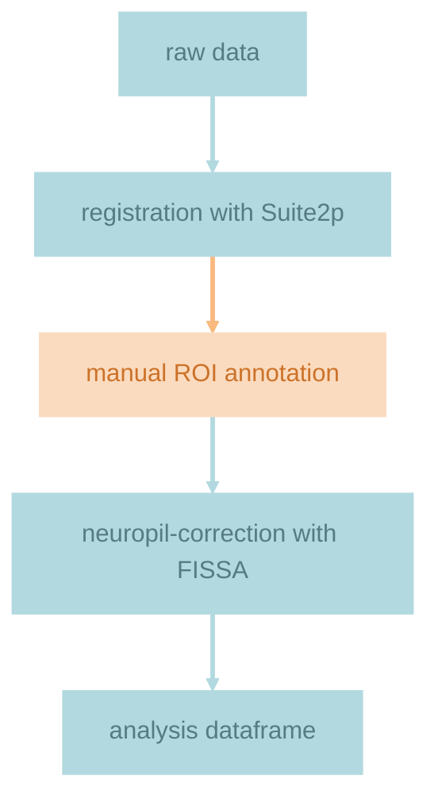
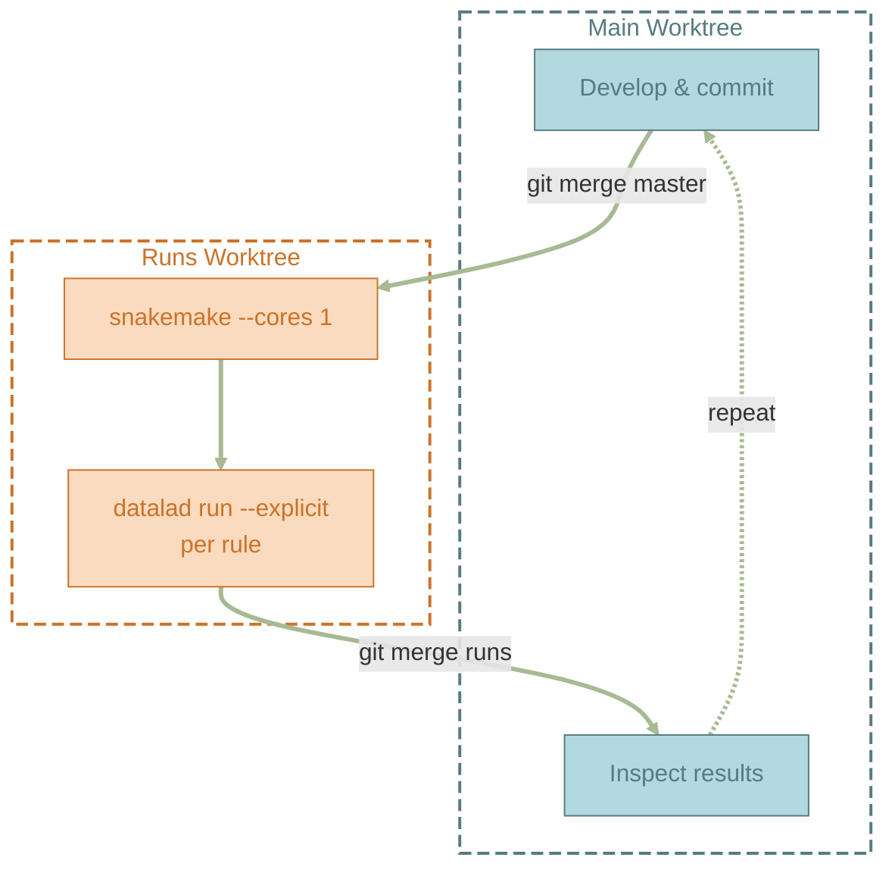

## Previously on git worktrees...

In the [previous post](), I introduced a workflow for
running [`datalad run`](https://docs.datalad.org/en/stable/generated/man/datalad-run.html) commands
in a dedicated git worktree in a different branch while continuing development in the main worktree.
The batch-processing script was a plain bash loop — it got the job done, but it had no notion of
what had already run, what was stale, or what depended on what. If the script failed half-way, a
rerun after the fix would either rerun everything again that did not fail, or require me to manually
comment out jobs. It also only ran one procedure for multiple subjects, but not all procedures for
one subject.

The natural next step: replace that bash loop with a proper workflow management system. Enter
[Snakemake](https://snakemake.readthedocs.io/).

## Why Snakemake?

There are [many workflow management systems](https://en.wikipedia.org/wiki/Scientific_workflow_system) out
there. You might already know [GNU Make](https://www.gnu.org/software/make/) — the original build
tool that checks file timestamps and only rebuilds what's out of date. Snakemake is Make's spiritual
successor (the name is literally "Snake (Python) + Make"), but designed for data pipelines instead
of C compilers. Like Make, it builds a directed acyclic graph (DAG) of rules, figures out what's
missing or outdated, and only runs what it needs to. Unlike Make, it's pure Python —
`pip install snakemake`, write a `Snakefile`, done. No extra infrastructure, same ecosystem as
DataLad.

What makes it a natural fit for DataLad is that both tools share the same mental model: **files in,
shell command, files out.** A Snakemake rule declares `input:`, `output:`, and `shell:`. A
`datalad run` call takes `-i/--input`, `-o/--output`, and a shell command. Both even use placeholder
expansion — DataLad's `{inputs}` and `{outputs}` resolve at run-time to whatever you specified with
`-i` and `-o`, while Snakemake's arbitrary [**wildcards**](https://snakemake.readthedocs.io/en/stable/snakefiles/rules.html#wildcards) 
like `{subject}` and `{experiment}` fan out one rule
across every parameter combination automatically. Where Make would need you to spell out every
target by hand (or write gnarly macro expansions), Snakemake generates N jobs from a single rule
definition, each becoming its own `datalad run` invocation with its own provenance record. Very handy!

The result: a Snakemake rule wraps a `datalad run` call without any glue code, adapters, or plugins
— Snakemake handles the orchestration, DataLad handles the provenance. Shared mental model,
distributed tasks.

Together, this gives me:

- **Automatic chaining** — Snakemake resolves the dependency graph, so I don't need to manually
  sequence steps (or to remember which steps need a rerun for which subjects and why ... seriously, how do
  people do it?)
- **Incremental execution** — only stale or missing outputs get recomputed
- **Provenance** — every step is a `datalad run` commit with full input -> output tracking

Ready to dive in?

## Chaining `datalad run` commands into a Snakemake workflow
### Pipeline DAG
In the following, I will illustrate the Snakemake-DataLad workflow on my neuroscience project, but
both tools are domain-agnostic! Here is a simplified view of my pipeline DAG:



Each step is a Snakemake rule wrapping a `datalad run` call. The manual GUI annotation step (warm
color) is the one human-in-the-loop gate in the pipeline.

### Snakefile, rules, and wildcards
The Snakefile for my pipeline looks like this:

```python
import glob

# wildcards
SUBJECTS    = ["sub-240222M", "sub-240226N", "sub-240226O"]
EXPERIMENTS = ["exp-Saline", "exp-Ketamine", "exp-LSD", "exp-Lisuride"]

# input function
def get_tifs(wildcards):
    return glob.glob(f"01_suite2p/{wildcards.subject}/{wildcards.experiment}/reg_tif/*.tif")

# final outputs of the pipeline
rule all:
    input:
        expand(
            "04_dataframes/{subject}/{experiment}/F.npy",
            subject=SUBJECTS,
            experiment=EXPERIMENTS,
        ),

# ... more rules
rule fissa:
    input:
        reg_tif  = get_tifs,
        rois     = "01_suite2p/{subject}/{experiment}/rois.npz",
    output:
        F        = "03_fissa/{subject}/{experiment}/F.npy",
    shell:
        """
        datalad run \
            --explicit \
            -m "Run fissa for {wildcards.subject} {wildcards.experiment}." \
            -i "{input.reg_tif}" \
            -i "{input.rois}" \
            -o "{output.F}" \
            "python code/src/process2p/run_fissa.py {{inputs}} {{outputs}}"
        """
# ... more rules
```

The `rule all` at the top is a convention — it doesn't run a command itself, but lists the final
files we want to exist. `expand()` generates all subject × drug combinations, and Snakemake works
backwards from there: "to produce this file I need `rule fissa`, which needs outputs from an earlier
rule, which needs..." — that's how the DAG gets built. 

`rule fissa` takes motion-corrected two-photon images in `reg_tif/`
and a set of selected ROIs (regions of interest) as `input:`,
and produces neuropil-corrected fluorescence signal as `output:`,
by executing the custom script `run_fissa.py` that is wrapped in a `datalad run` command in `shell:`.

Note that `reg_tif` is defined as `get_tifs` — a Python function that globs the `.tif` files at rule 
resolution time.
This way Snakemake tracks each individual file as a dependency,
so if any `.tif` changes (e.g. after rerunning motion correction with different parameters),
Snakemake knows to rerun fissa.
Simply declaring the directory as input would miss in-place file modifications.

A word on placeholders — there are three kinds at play here.
**Wildcards** like `{subject}` and `{experiment}` appear in `input:` and `output:` paths
and get expanded at execution time,
producing one `datalad run` invocation per (subject, experiment) combination.
Inside `shell:`, they must be referenced explicitly as `{wildcards.subject}` and `{wildcards.experiment}`.
**Directive placeholders** like `{input.reg_tif}` and `{output.F}`
let you reference resolved `input:` and `output:` values inside `shell:`,
so you don't repeat paths.
Both of these are Snakemake's — it expands them before the shell command runs.

Then there are `{inputs}` and `{outputs}` — DataLad's own placeholders.
They look similar but serve a completely different purpose:
Snakemake's `input:` and `output:` are for **staleness detection** —
they define the DAG but are entirely decoupled from what happens inside the shell command.
DataLad's `-i` and `-o` are for **provenance tracking and computation** —
they record which files were consumed and produced,
and `{inputs}`/`{outputs}` pass those files as arguments to the actual script.
To prevent Snakemake from expanding them,
they're escaped with double braces: `{{inputs}}` and `{{outputs}}`.

Because the two serve different purposes, they don't have to agree.
Staleness detection works best at the individual file level,
but for provenance and computation it can be more convenient
to pass entire directories as inputs or outputs.
Conversely, staleness detection can target a subset of files
(you don't need to track every single intermediate artifact for the DAG to work),
whereas provenance should always record the complete set of inputs and outputs.

### Dirty is the new clean!
By default, `datalad run` checks that the dataset is clean before executing. Snakemake, however,
**removes stale outputs before running a rule** — that's how it guarantees a fresh build. This means
that by the time `datalad run` executes, the dataset is already dirty from the deletions. The fix is
`--explicit`: it tells `datalad run` to only track the files explicitly listed in `-i` and `-o`,
skipping the global cleanliness check. To ensure full reproducibility, I recommend running snakemake
only when the state of the dataset is clean and adding a dedicated check right at the start of the
snakefile:

```python
# ── Pre-flight: dataset must be clean (skipped during dry-run) ────────────
import sys

if not any(f in sys.argv for f in ("-n", "--dryrun", "--dry-run")):
    _status = subprocess.run(
        ["git", "status", "--porcelain"],
        capture_output=True, text=True,
    )
    if _status.stdout.strip():
        raise RuntimeError(
            "Dataset is not clean — commit or stash changes before running "
            "snakemake.\n\n  datalad status\n\n" + _status.stdout
        )
```

Apart from this little inconvenience, Snakemake's design of removing staled outputs turns out to
have multiple benefits:

1. Removing annexed files is instant (just delete the symlink), whereas `datalad unlock` on large
   binary files can take a very long time because it replaces the symlink with a full copy. So
   Snakemake's "delete first, write fresh" approach is actually *faster* than the unlock-modify-save
   cycle.
2. Some software intentionally reuses existing outputs to avoid heavy recomputation. This can be
   convenient when you are sure that the outputs won't change, but for full reproducibility a fresh
   computation of outputs should be the go-to.

That said, you can avoid the auto-removal of specific outputs simply by not declaring them as
outputs (skip staleness detection) since Snakemake's `output:` is completely decoupled from what 
DataLad or your script sees. 

### Run, Snakemake! (Or schlängeln?)

Once the Snakefile exists (by convention as `./Snakefile`, but you can choose your own location and
file name and specify with `-s <path>`), you can see what Snakemake would execute with a dry run `-n/--dry-run`:

```bash
< snakemake --cores 1 --keep-going -dry-run
# detailed jobs
# ...

# summary
Job stats:
job                 count
----------------  -------
all                     1
create_dataframe       24
fissa                  24
total                  49

Reasons:
    (check individual jobs above for details)
    input files updated by another job:
        all, create_dataframe, fissa
    output files have to be generated:
        auto_sort, create_dataframe, fissa
    updated input files:
        auto_sort
This was a dry-run (flag -n). The order of jobs does not reflect the order of execution.
```

If one job fails, naturally all subsequent jobs that depend on it should be skipped. However, independent 
jobs (e.g. of a different subject) can still be carried out with `-k/--keep-going`.

### Provenance at the cost of parallelism
Snakemake is designed for parallelism —
give it `--cores 8` and it will run independent rules simultaneously.
But `datalad run` commits after every rule,
and git only supports one writer at a time.
The pipeline has to run sequentially: `--cores 1`.

This is a fundamental git limitation, not a Snakemake or DataLad one,
and it has two layers.
The first is the **git index** —
each commit needs exclusive access to `.git/index`,
which is a single file protected by a lockfile.
Multiple worktrees solve this:
each worktree has its own index,
so N worktrees on N branches can commit in parallel.
But there is a second layer:
the **git-annex branch**.
Every time `datalad run` produces an annexed file,
git-annex records its location on a shared `git-annex` branch —
and this branch is shared across all worktrees.
So even with multiple worktrees,
concurrent annex updates still collide.

For full parallelism, separate **ephemeral clones** are needed —
throw-away clones that share the annex object store,
but each have their own index and their own `git-annex` branch.
This is the approach described in the
[FAIRly big processing workflow](https://www.nature.com/articles/s41597-022-01163-2).
For less production-ready workflows that may be overkill.

Even so, Snakemake still provides its core value — staleness detection and
automatic chaining — which is why I'm here in the first place.
But staleness detection has some sharp edges
when combined with git and worktrees.

## Timestamps and metadata: the tension between git and Snakemake

### How Snakemake decides what to rerun

Snakemake does not rely on file modification timestamps (mtimes) alone.
Since [version 7.8](https://github.com/snakemake/snakemake/issues/1694),
it checks **five rerun triggers** (all enabled by default):

1. **mtime** — is any input file strictly newer than the oldest output?
2. **code** — has the rule's shell command or script changed?
3. **params** — have the rule's parameters changed?
4. **input** — has the *set* of input files changed (files added or removed)?
5. **software-env** — has the conda environment or container image changed?

The mtime check uses the filesystem.
The other four compare the current rule definition against
**stored metadata** in `.snakemake/metadata/` —
a local, untracked directory where Snakemake records,
for each output file,
the shell command, input set, parameters, and environment
that produced it.
If *any* trigger fires, the job reruns.

Now, **git does not store mtimes** —
this is a [known tension](https://github.com/datalad/datalad/pull/4864#issuecomment-686926998)
between git and timestamp-based workflow managers.
And `.snakemake/` is untracked,
so it is not shared across worktrees or clones.
This combination creates several sharp edges.

### Selective vs. blanket git operations

The `runs` worktree needs to stay in sync with `master`
as I develop code and push new commits from the main worktree.
Before Snakemake, I used `datalad foreach-dataset git reset --hard master` —
I loved this trick:
**reset to the future!** —
the worktree has access to all newer commits on `master`
without fetching, because it's a worktree, not a clone,
and any unwanted changes get wiped in the process.

But `git reset --hard` is a **blanket operation** —
it rewrites all tracked files, even those whose content hasn't changed.
Every file's mtime becomes *now*,
the relative ordering is destroyed,
and Snakemake's mtime trigger can no longer tell what's stale.

The fix: use `git merge` instead.
A merge is a **selective operation** —
it only touches files whose content actually changed,
leaving mtimes of unchanged files intact.
(Other selective operations include
`git pull`, `cherry-pick`, `rebase`, and `stash pop`.
Other blanket operations include
`git clone` and `git checkout` when switching to a distant branch.)

Even with a merge,
files that *did* change are written sequentially
within a few moments of each other.
Their mtimes reflect git's internal write order,
not the pipeline's execution order —
the ordering among them is essentially arbitrary.
But this is usually fine — unless you run pipeline steps
in different worktrees and merge between them.

### Always run Snakemake in the same worktree

Each worktree has its own files with its own mtimes,
and its own `.snakemake/` metadata.
Neither is shared across worktrees.
This means: **all pipeline steps must happen in the same worktree**.

Say I run rule A in the `main` worktree, then `git merge master` in `runs`.
The merge brings A's outputs (and any updated inputs) into `runs`,
but all merged files get mtime = *now*.
Snakemake's mtime check uses strict greater-than (`>`),
so files written in the same merge are effectively unordered —
whether an input appears newer than its output depends
on which file git happened to write last.
The mtime trigger becomes a coin flip.

The metadata triggers don't help either.
`.snakemake/metadata/` in `runs` still has the record
from the *last time* `runs` itself ran rule A (if ever).
If the rule definition hasn't changed, those triggers stay quiet —
but the mtime coin flip remains.
If the rule definition *has* changed
(e.g. you updated the script before rerunning in `main`),
the code trigger fires — correctly flagging a rerun,
but a redundant one since `main` already produced the correct output.

The bottom line: mixing execution across worktrees
makes staleness detection unreliable.
Run everything in one worktree and the problem disappears.

### Fresh clones and new worktrees: starting without history

In a typical Snakemake project, outputs aren't tracked in git —
they live in `.gitignore`.
After a fresh clone they simply don't exist,
`missing_output` fires for every rule,
and you get a correct full rerun.
No problem.

But DataLad tracks everything, including outputs.
In a DataLad dataset with git-annex,
outputs after a clone are broken symlinks (content not yet fetched),
so `missing_output` still fires — still safe.
The problematic case is a fresh clone
where all content has been fetched (e.g. after `datalad get`):
all files are present, but **mtimes reflect git's write order,
not the pipeline's execution order**.
With Snakemake's strict greater-than comparison,
whether a rule appears stale depends on which file git happened to write last.
And since `.snakemake/` doesn't exist,
you might expect the metadata triggers to catch what mtimes miss —
but Snakemake treats missing metadata as "no change detected."
The result is **unpredictable staleness detection**:
some rules may rerun, others won't,
with no relation to actual pipeline state.

This isn't a Snakemake bug —
Snakemake was not designed for outputs living in version control.
It's an impedance mismatch with DataLad's approach of tracking everything.

Two tools can help.
`snakemake --touch` updates output mtimes
*and* writes full `.snakemake/metadata/` records,
so all five triggers consider everything up-to-date on the next run.
Use with care — you're telling Snakemake "trust me, everything is fresh,"
and it will believe you.
A tool like [git-restore-mtime](https://github.com/MestreLion/git-tools)
takes a lighter approach:
it sets each file's mtime to the timestamp of the last commit that modified it,
restoring the correct ordering for the mtime trigger
but leaving `.snakemake/metadata/` empty —
which is fine, since missing metadata doesn't trigger reruns anyway.

### A note on `git clean` and Snakemake's local state

Since `.snakemake/` is untracked, it can be accidentally destroyed.
If a `datalad run` fails and leaves empty directories or untracked files,
you might reach for `git clean` to tidy up.
Use `git clean -df` (remove untracked files and directories),
but **never `git clean -dfx`** —
the `-x` flag also removes *ignored* files,
which includes `.snakemake/`.
Losing that directory puts you in the same state as a fresh clone:
no metadata, unpredictable staleness detection.

## All the twists for a tiny hiss



| Caveat                                    | Cause                                                           | Workaround                                         |
|-------------------------------------------|-----------------------------------------------------------------|----------------------------------------------------|
| Dirty working tree upon `datalad run`     | Snakemake deletes stale outputs before running                  | `--explicit` + pre-flight status check             |
| No parallel execution                     | Worktrees share `git-annex` branch; parallel commits would race | Go sequential with `--cores 1`                     |
| `git reset --hard` break staleness        | Blanket git ops destroy mtime ordering                          | Use selective ops (`git merge`) instead            |
| Switching worktrees breaks staleness      | mtimes and `.snakemake/` metadata are both per-worktree         | Always run all pipeline steps in the same worktree |
| Fresh clone has unpredictable reruns      | No `.snakemake/` metadata; mtimes unordered                     | `snakemake --touch` or `git-restore-mtime`         |
| `git clean -dfx` destroys Snakemake state | Removes `.snakemake/` (local metadata, not in git)              | Use `git clean -df` instead                        |

Happy automating! 🐍
